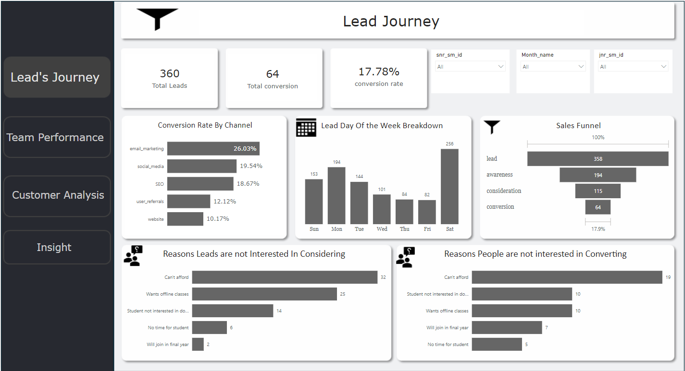
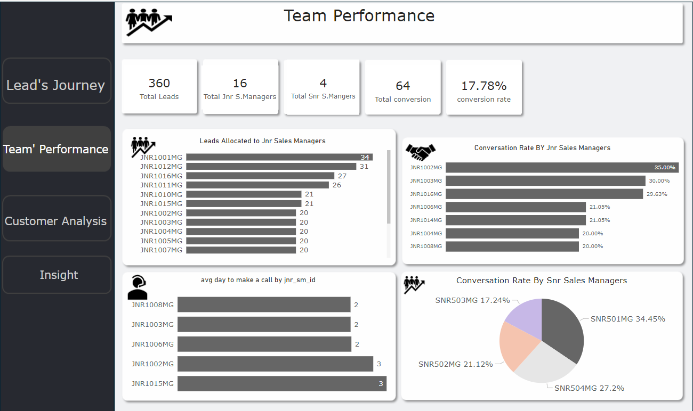
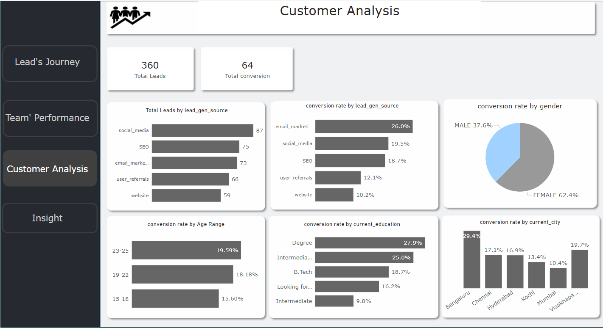

# EDU-TECH-Customer Segmentation Targeted Marketing

## Project Overview:
 This project is focused on accelerating growth by increasing the number of enrolled users. The primary objective is to analyze various aspects of customer acquisition to understand the status of new user growth within the company. By providing insights, the aim is to assist the business team in designing a more effective marketing strategy, while also evaluating team performance and demographics of leads and converted leads

 ## Data Set Description:
 The analysis will be based on three months of data spanning various stages of the customer acquisition process.
 The dataset comprises four tables:
 
 1. Customer Acquisition Key Stage
 2. Lead Basic Details
 3. Sales Manager Assigned Leads Details
 4. Lead Interaction Details

 ## Power BI Link:
https://app.powerbi.com/links/z7ap5H7gRh?ctid=056e52ff-3fcb-4f6b-8251-481ea120fd41&pbi_source=linkShare

### Lead's Journey and Stages

### Team Performance

### Customer Analysis

